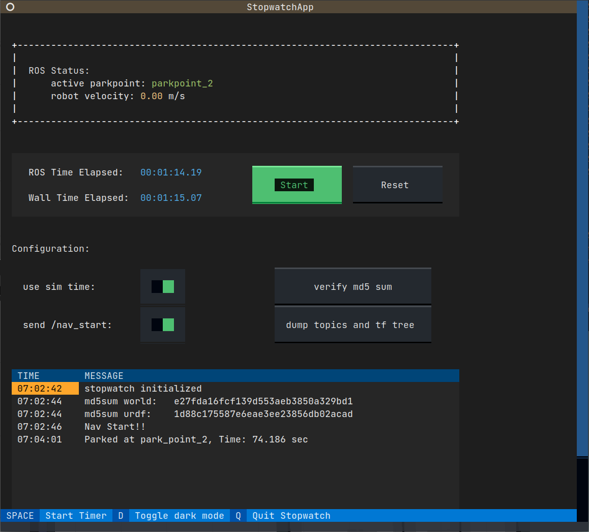

# ucar_stopwatch

16届智能车校内赛ROS组的, 计时工具



## 安装依赖

安装textual

```sh
pip install textual
```

## 构建

将本功能包放到工作空间里, 并编译

## 运行使用

启动

```sh
roslaunch ucar_stopwatch ucar_stopwatch.launch
```

摁 "Start" 或者按空格键发车  
就可以了  
